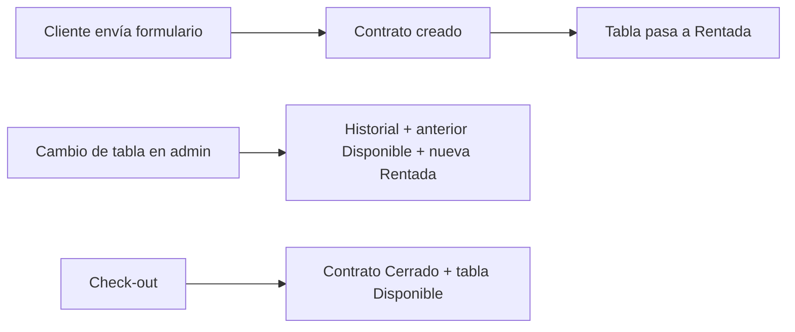

# Manual de formación — Sistema de formularios Agua Tibia Surf School

Este documento sirve para **formar al personal** en el uso diario de la herramienta web: formulario público de renta, panel administrativo, inventario de tablas y los flujos que conectan contratos con el estado de las tablas.

---

## 1. Qué es el sistema

La aplicación web permite:

1. **Que los clientes** firmen un **acuerdo de renta** en línea (datos de contacto, fechas, tabla elegida, productos opcionales de tienda, firma y condiciones).
2. **Que el equipo** revise y gestione esos **acuerdos** y el **inventario de tablas** desde un **panel protegido** (inicio de sesión con usuario y contraseña creados en Supabase).

La barra superior tiene dos modos:

| Botón        | Uso principal |
| ------------ | ------------- |
| **Formulario** | Vista que ve el **cliente** para enviar un nuevo contrato. |
| **Admin**      | Panel interno para **empleados** (tras iniciar sesión). |

---

## 2. Formulario público de renta (cliente)

### 2.1 Quién lo usa

Cualquier persona con el enlace al sitio. No hace falta usuario ni contraseña.

### 2.2 Qué debe completar el cliente

- Datos personales (nombre, email, teléfono, dirección si aplica).
- Fechas/horas de **pickup** y **retorno** según lo acordado.
- **Tabla de surf**: solo puede elegir tablas que en el inventario estén en estado **Disponible**. En pantalla se muestra **marca y número** (por ejemplo `Firewire · 12`); en el contrato se guarda el **número de tabla** que corresponde al inventario.
- Opciones de **renta** (tipo y duración) según el catálogo de la escuela; el precio base se calcula automáticamente.
- **Productos de tienda** (opcional): líneas con nombre y precio; el **precio total del contrato** incluye renta base + tienda.
- **Método de pago** e indicación si el contrato queda **pagado** o **pendiente de pago** (según cómo cobréis en recepción).
- **Firma** en el lienzo y aceptación de términos.

### 2.3 Qué ocurre al enviar

- Se registra el **acuerdo** en el sistema.
- Las **líneas de tienda** quedan asociadas al mismo contrato.
- En base de datos, la tabla elegida pasa automáticamente a estado **Rentada** en el inventario (ya no aparece como disponible para otro contrato nuevo hasta que liberéis esa tabla con los procesos del panel).

---

## 3. Acceso al panel administrativo

1. Clic en **Admin** en la barra superior.
2. Introducir **email** y **contraseña** del usuario de staff (proporcionado por la escuela; las cuentas se gestionan en Supabase Auth).
3. Tras un login correcto, se muestra el **panel** con menú lateral.

### 3.1 Secciones del panel

| Sección | Contenido |
| ------- | --------- |
| **Acuerdos de renta** | Listado de contratos, búsqueda, detalle, edición y acciones. |
| **Inventario de tablas** | Alta, edición y estado de cada tabla (marca, número, descripción interna, estado operativo). |

Desde el menú lateral también podéis **cerrar sesión** cuando terminéis.

---

## 4. Acuerdos de renta

### 4.1 Listado y búsqueda

- Podéis **buscar** por nombre, email, teléfono o por texto relacionado con la tabla (marca o número).
- La columna **Fecha de retorno** muestra la fecha/hora de retorno acordada (no la fecha de alta del contrato).
- La columna **Tabla** muestra **marca · número** cuando la tabla existe en el inventario; si el número guardado ya no coincide con el inventario actual, el detalle puede indicarlo.

### 4.2 Estados que ve el panel (badge)

El sistema calcula etiquetas útiles para el día a día, por ejemplo:

- **Pendiente de retirar** — el pickup aún no ha llegado.
- **Activo** — en periodo de renta según fechas.
- **Vencido** — la fecha de retorno ya pasó (según lo guardado).
- **Cancelado** — si el estado en base de datos es cancelado.
- **Cerrado** — el contrato se dio por finalizado con **check-out** (ver más abajo).
- Otros estados internos de la base de datos pueden mostrarse con su etiqueta en español.

Los contratos **cerrados** suelen agruparse al **final** del listado para priorizar los activos.

### 4.3 Ver detalle (icono de ojo)

Abre una vista de solo lectura con datos del cliente, fechas, tabla, precio, pago, productos de tienda, firma si existe, e **historial de cambios de tabla** (si hubo sustituciones durante la renta).

### 4.4 Editar (icono de lápiz)

Permite:

- Ajustar **pickup** y **retorno**.
- **Cambiar de tabla** durante la renta (ver sección 5).
- Gestionar **productos de tienda** y el **precio total** (renta base del paquete + suma de tienda).
- **Contrato pagado** y **Board checked by** (personal que revisó la tabla).
- **Check-out — cerrar contrato**: cuando el cliente **devuelve** la tabla y se da el contrato por terminado.

#### Check-out (cerrar contrato)

- Botón **Check-out — cerrar contrato** (zona dedicada en la pantalla de edición).
- Al confirmar, el acuerdo pasa a estado **Cerrado** y la tabla asignada en inventario vuelve a **Disponible** para otra renta.
- Un contrato **cerrado** ya no se puede editar como un contrato activo; la pantalla muestra un resumen y la opción de volver atrás.

---

## 5. Cambio de tabla en mitad de renta

Cuando un cliente **ya tiene** una tabla asignada y quiere **cambiar a otra**:

1. Abrir el acuerdo con **Editar**.
2. Usar **Hacer cambio** junto a la información de la tabla actual.
3. Buscar la **nueva tabla** (solo aparecen tablas **Disponible** en inventario).
4. **Registrar cambio**.

Qué hace el sistema:

- Guarda el cambio en el **historial** (tabla anterior → tabla nueva), visible en edición y en la vista de detalle.
- En inventario: la tabla **anterior** pasa a **Disponible** y la **nueva** a **Rentada**.

No se puede cambiar tabla si el contrato está **cerrado**.

---

## 6. Inventario de tablas

### 6.1 Campos importantes

| Campo | Uso |
| ----- | --- |
| **Marca** | Visible para el cliente junto al número al elegir tabla. |
| **Nº de tabla** | Identificador único; es lo que queda ligado al contrato. |
| **Descripción** | Solo **interna** (modelo, medidas, notas de equipo); **no** la ve el cliente en el formulario público. |
| **Estado** | Ver siguiente apartado. |

### 6.2 Estados del inventario

| Estado | Significado operativo |
| ------ | --------------------- |
| **Disponible** | Puede elegirse en el **formulario público** y para **asignar** en un cambio de tabla. |
| **Rentada** | Asignada a un contrato activo (o recién firmado); no sale en el formulario público. |
| **En mantenimiento** | No disponible para renta hasta que paséis el estado a Disponible. |
| **Vendida** | Baja lógica; no disponible para nuevas rentas. |

Al **enviarse un nuevo contrato** con una tabla, esa fila pasa a **Rentada** automáticamente. Al **cerrar** un contrato con check-out, esa tabla vuelve a **Disponible**.

### 6.3 Alta y edición

- **Añadir tabla**: rellenar marca, número, estado (por defecto suele ser Disponible) y descripción opcional.
- **Editar / eliminar**: desde la tabla del inventario según permisos.

---

## 7. Resumen de flujos (de punta a punta)

1. **Nuevo alquiler**: formulario público → contrato → tabla **Rentada**.
2. **Cambio durante la renta**: editar acuerdo → **Hacer cambio** → historial + inventario actualizado.
3. **Fin de la renta**: editar acuerdo → **Check-out — cerrar contrato** → contrato **Cerrado**, tabla **Disponible**.

---

## 8. Buenas prácticas para el equipo

- Revisad periódicamente el listado por **fecha de retorno** y el **estado** de los acuerdos.
- Mantened el **inventario** al día: estados correctos y descripciones internas útiles para quien entrega las tablas.
- Si un número de contrato **no coincide** con ninguna fila del inventario, el detalle puede avisar; corregid inventario o el dato del contrato según proceda.
- **Cerrad sesión** en equipos compartidos al terminar.

---

## 9. Glosario rápido

| Término | Significado |
| ------- | ----------- |
| **Acuerdo / contrato** | Registro de la renta firmada (cliente + condiciones + tabla + precio). |
| **Pickup / retorno** | Fechas u horas de recogida y devolución acordadas. |
| **Check-out** | Acción de **cerrar** el contrato y **liberar** la tabla en inventario. |
| **Historial de cambios de tabla** | Registro de sustituciones de una tabla por otra en el mismo contrato. |
| **RLS / Supabase** | Aspectos técnicos de seguridad y base de datos; el personal no necesita operarlos. |

---

## 10. Soporte técnico

Para incidencias (no cargan datos, error al guardar, acceso perdido), contactad con quien gestione las **cuentas de Supabase** y el **despliegue** de la web. Este manual describe el **uso funcional** de la herramienta, no la administración de servidores.

---

*Documento orientado a formación interna — Agua Tibia Surf School.*
